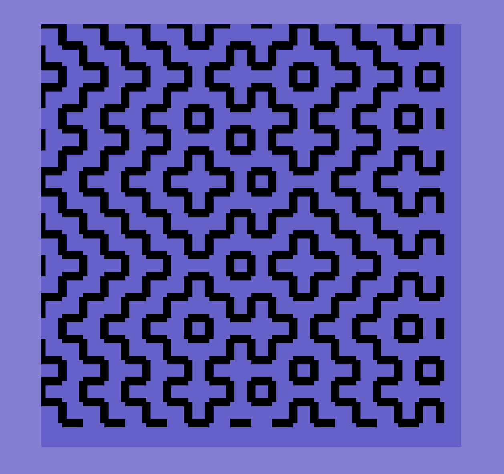

# Hitomezashi Patterns

Let's make some patterns!

Each pattern is composed of a set of horizontal and vertical lines.

Each line is composed of alternating line segments and empty spaces (like a dashed line).

Different patterns emerge when we offset these lines according to different rulesets. (Where a "ruleset" is a list of 0s and 1s, to indicate whether to offset the line or not.)

